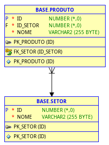
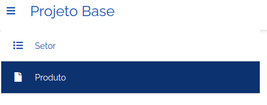
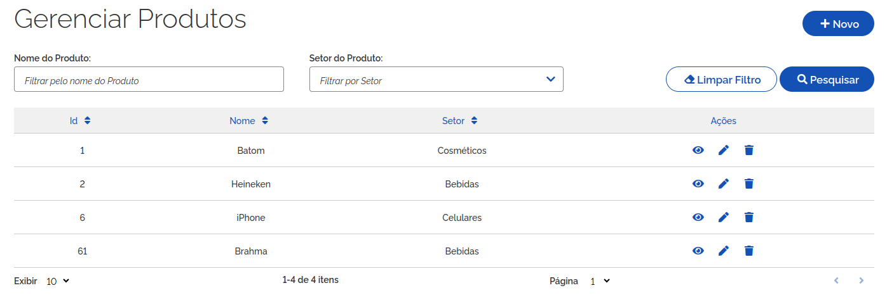
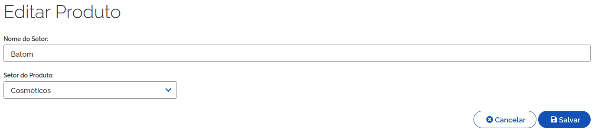
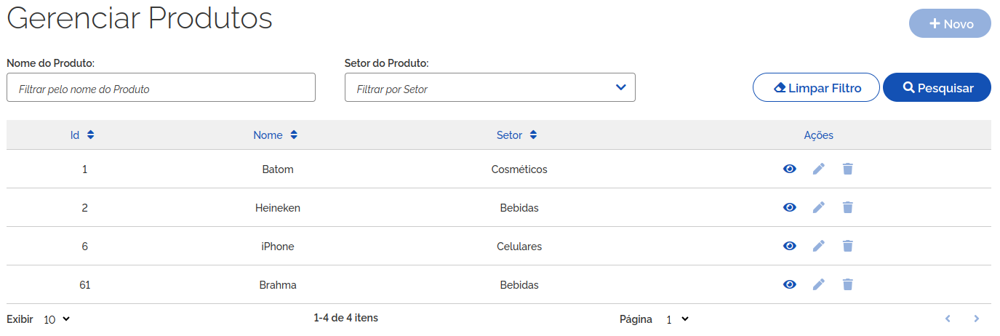
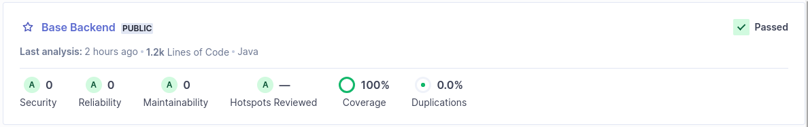
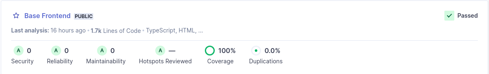

# Projeto Base

O presente projeto é referência, ou base, para o desenvolvimento de novos sistemas no Ibama. Ele é divido em backend, desenvolvido em Java, e frontend, ambientado em Node.js e Angular Typescript.

Para exemplificar os diversos elementos e aspectos do desenvolvimento de software nessas plataformas, estãos dispostos dois CRUDs (Create, Read, Update e Delete): produto e setor. Sendo setor, o setor ou categoria do produto. Portanto, são funcionalidades para manutenção de cadastro de produtos e seus setores.

A relação entre as entidades é: todo produto pertence a um setor, mas nem todo setor possui produtos. Ou seja, uma relação 1xN entre prouto e setor.

O projeto Base distribui tais funcionalidades ao longo de 3 camadas: banco de dados, backend e frontend. E, assim como o software em si, este documento é estruturado de forma contextualizada nessa organização.

## 1. Pré-requisitos

O projeto Base, como uma aplicação corporativa, utiliza banco de dados relacional para armazenamento dos registros de setores e produtos.

Esta documentação não tem escopo a instalação da infraestrutura de software do projeto, qual seja: banco de dados H2, banco de dados Oracle, Java, Apache Maven, Node.js ou NPM.

A partir dessas ferramentas, o projeto pode ser construído e executado.

### 1.1 Banco de Dados

O banco de dados utilizado no projeto Base depende do perfil spring boot utilizado na execução do backend. Maiores detalhes a respeito de perfil de execução do backend serão apresentados nas seções seguintes deste documento.

Por ora, é suficiente informar que o projeto Base já contém configurações para uso do banco H2 (perfil local) e banco de dados Oracle (demais perfis). Quando utilizado o banco de dados Oracle, a versão recomendada de uso é 19.3.

### 1.2 Backend

O módulo backend do projeto Base está apoiado no framework Spring Boot, na versão 3.3.7, mais especificamente. No entanto, na construção do módulo é usado o Apache Maven como plataforma de gestão de dependências do Spring Boot e também quem coordena a execução de testes unitários assim como a própria construção do artefato final. Tudo isso, apoiado em Java, versão 21 ou superior.

### 1.3 Frontend

Já o módulo frontend se utiliza de Node.js e Angular para implementar as funcionalidades acima citadas, ou seja, os CRUDs de produtos e setores.

A versão 20.18 do Node.js é sugerida para ser instalada como base desse módulo. Já a versão 10.8 é a versão de referência para o gestor de pacotes NPM. A partir dessa infraestrutura, o módulo está pronto para sua construção.

## 2. Instalação

A construção dos módulos backend e frontend do projeto base podem ser efetivadas de forma paralela e completamente independente. Obviamente, o contrário ocorre na execução na qual o backend depende da existência e perfeitas condições de funcionamento do banco de dados. Assim como o frontend é totalmente dependente, quanto a seu funcionamento, do módulo backend ligado e funcional.

### 2.1 Backend

Com JDK 21 e Apache Maven disponíveis, ou com a utilizado de plugin compatível da IDE preferida, o seguinte comando deve ser executado para construção do backend, dentro da pasta de mesmo nome:

`mvn clean package -DskipTests`

Após a conclusão da construção, o arquivo base.jar está disponível na subpasta target. A cláusula `-DskipTests` evita a execução de testes unitários os quais podem ser avaliados com a supressão da mesma.

### 2.2 Frontend

Da mesma forma que no backend, o frontend pode ser construído através de execução da construção na linha de comando ou com uso de plugin de IDE de desenvolvimento. Atendo-se à linha de comandao, para construir esse módulo deve-se executar:

`npm install`

A construção executada faz a descarga de todas as bibliotecas das quais o frontend necessita. Inclusive o framework Angular Typescript da versão 15, ambiente no qual a identidade visual gov.br está apoiada. Não só a identidade, mas componentes angular gov.br são importadas e incorporadas ao módulo.

A [Padrão Digital do Governo](https://www.gov.br/ds/home) pode ser consultado para maiores detalhes a respeito da referida identidade visual padrão.

## 3. Implantação e Execução

A execução dos módulos backend e frontend do projeto Base pode ser efetuadas de forma autônoma (standalone) ou como parte de ferramentas de orquestração como Azure, Openshift ou AWS.

Cada qual dos módulos possui o diretório devops com arquivo Dockerfile referência para implantação em contexto de conteinerização.

A presente documentação se limita ao contexto de execução autônoma apenas.

### 3.1 Backend

No contexto de backend, a execução faz uso direto de um dos executáveis Java. Dentro da pasta backend, executar:

`java -jar target/base.jar`

O framework Spring Boot, base desse módulo, em sua construção importa servidor web e o embute no arquivo base.jar. Portanto, a execução do comando acima disponibiliza as funcionalidades REST do backend na porta 8080 do servidor que o inicia.

Uma rápida consulta à documentação do Spring Boot permite alteração da porta padrão de execução do backend. O que implica alterar arquivo de configuração no perfil de execução almejado.

### 3.2 Frontend

O frontend pode ser disparado de duas formas: como parte do servidor Node.js ou como pacote a ser implantado em servidor web como Apache. A esta última, dá-se o nome de versão minificada do módulo.

Ao executar `npm start`, esse módulo inicia o serviço e o disponibiliza na porta 80. Assim como no backend, a porta de execução pode ser alterada no arquivo package.json, especificamente no *script start*. Em ambiente, Linux tal execução exige permissionamento de super usuário para que o serviço possa ser hospedado na porta 80.

O Angular permite a minificação do módulo frontendo, o que tem como consequência a construção de um pacote composto, essencialmente, de elementos fundamentais da tecnologia web (arquivos html, css e imagens). Para produzir tal pacote, executar:

`npm build --prod`

O parâmetro `--prod` indica o arquivo contendo endereço http, ou https, do próprio frontend como do backend. O primeiro endereço como referência de roteamento entre as telas do frontend. O segundo como referência ao backend sobre o qual requisições REST são acionadadas para cumprimento das funções CRUD de setor e de produto.

## 4. Características

Algumas informações adicionais merecem destaque e são distribuídas nas seções seguintes, conforme as camadas do projeto Base.

### 4.1 Banco de dados

Conforme supracitado, o banco de dados H2 ou Oracle pode ser utilizado como camada de armazenagem de dados. 

Independetemente da plataforma de banco de dados adotada, o módulo backend utiliza a biblioteca de gestão da estrutura de banco de dados Liquibase. Com efeito, toda vez que esse módulo é disparado uma avaliação automática ocorre sobre o banco de dados em busca de diferenças entre o que o módulo necessita para seu correto funcionamento e aquilo presente neste banco.

Na prática, e em específico do projeto Base, o par de tabelas produto e setor é investigado na base de dados. O esperado, é uma estrutura de dados correspondente ao representado no diagrama de entidade-relacionamento abaixo:

A funcionalidade de rollback do Liquibase pode ser utilizada para desfazer parcial, ou integralmente o conjunto de script de criação das tabelas acima. A documentação de [rollback](https://docs.liquibase.com/commands/rollback/rollback.html) do liquibase contém maior detalhamento de execução.

### 4.2 Backend

mvn verify

O módulo backend do projeto Base está apoiado no framework Spring Boot, mais especificamente, na versão 3.3.6. Como tal, ele permite a utilização de vários perfis de execução, o que flexibiliza a construção e mudança entre diferentes configurações conforme o ambiente de trabalho de maneira rápida e prática. Apesar de poder ser alterada ou estendida, a presente conjuntura de perfis do módulo conta com os seguintes contextos:

- Local - application-local.yml : frequentemente utilizado no cenário em que os bancos de dados Oracle não estão disponível. Tal perfil utiliza banco de dados H2;
- Development - application-dev.yml: perfil utilizado na maior parte do tempo para desenvolvimento e testes das funcionalidades do módulo;
- Homologação - application-hom.yml: perfil do ambiente de homologação, onde as funcionalidades estão mais estáveis e o usuário Ibama pode experimentar a aplicação;
- Production - application-prod.yml: contém as configurações adotadas em ambiente de produção;

Novamente, mais perfis podem ser adicionados a este conjunto de perfis.

A ausenção de especificação de perfil de execução implica adoção do perfil padrão ativo definido no arquivo application.yml:

    spring:
        profiles:
            active: local

Aquivo indicando o perfil local como padrão de execução.

Dentre as configurações de banco de dados, pode-se destacar a definição do schema padrão de uso pelo backend:

    spring:
        jpa:
            properties:
                hibernate:
                    '[default_schema]': base

Isso decorre da política da administração dos banco de dados do Ibama que impõe a distinção entre schema de conexão com o banco de dados do schema proprietário dos dados.

Por fim, um seção importante de configuração do backend diz respeito ao SCA2 (Sistema de Controle de Acesso). Esse software não é parte do projeto Base, mas é quem realiza as funções de autenticação de usuário e autorização de uso de recurso conforme perfil de usuário. O detalhamento do funcionamento e, principalmente a configuração de uma aplicação junto ao SCA 2, foge ao escopo desta documentação. No entanto, de forma resumido os seguintes elementos devem ser criados e associdados entre si no SCA 2:

- Aplicação: identifica a aplicação repositório elementos necessários às funções de autenticação e autorização;
- Módulo, funcionalidade e ação: ao menos, cada um desses elementos deve ser criado denro de uma aplicação SCA 2;
- Perfil de usuário: ao menos um perfil circunscrido à aplicação deve ser criado. O projeto Base não associa qualquer de suas funcionalidades a qualquer perfil que devesse autorização sua utilização. No entanto, cabe esclarecer que isso é possível incorporar, principalmente no módulo backend;
- Vínculo usuário e perfil: associa um usuário, tipicamente um CPF pré-configurado no sistema SIGER, a um perfil definido na aplicação;
- Montagem de perfis de usuário: no projeto Base foram criados no SCA 2 dois perfis (ROLE_BASE_VIS_FUNC_VIS_ACESSAR e ROLE_BASE_ADM_FUNC_CAD_CADASTRAR); o primeiro permite a visualização de dados enquanto que o segundo permite criar, editar ou remover elementos dos CRUDs de setor e de produto;

No cenário em que o usuário somente possui perfil de adminstrador, a listagem de registro está proibida. A tela abaixo mostra a falha que ocorre no backend ao acessar o endpoint para listagem de produtos:

As propriedades do backend, abaixo, contém diferentes partes do processo de comunicação com o SCA, circunscritos ao login, validação de token e logout.

    security:
        sca2-login-get-jwt: https://homsca2.ibama.serpro.gov.br/sca2sessao/api/v2/sessao/login?service=%s&ticket=%s
        sca2-login-redirect: https://homlogin.sso2.ibama.serpro.gov.br/cas/login?service=%s
        sca2-system-url: http://127.0.0.1/base/login
        sca-get-token: https://homlogin.sso2.ibama.serpro.gov.br/sca2sessao/api/v2/sessao/login
        sca-token-validator: https://homsca2.ibama.serpro.gov.br/sca2sessao/api/v2/sessao/validar
        sca-logout: https://homsca2.ibama.serpro.gov.br/sca2sessao/api/v1/sessao/logout
        sca-logout-redirect: https://homlogin.sso2.ibama.serpro.gov.br/cas/logout?service=

Grande parte dos endereços das propriedades acima se referem ao servidor de homologação do SCA 2 e, num horizonte próximo, é improvável que **não** seja utilizado por qualquer dos ambientes de um projeto decorrente do projeto Base. No entanto, uma especial atenção é necessária à propriedade `sca2-system-url` pois define o endereço que o navegador web é roteado nas seguintes situações:

- Login bem sucedido do usuário no SCA 2;
- Ao acessar qualquer das telas do frontend de acesso restrito, e o usuário não estiver autenticado, o roteamento do navegador web ocorre conteúdo o valor dessa propriedade entre seus parâmetros. É esse parãmetro que identifica a aplicação requisitante de login no SCA 2, e para o qual o roteamento de volta é executado em caso de login bem sucedido;

### Frontend

Conjunto de configurações do frontend é diminuto quando comparado ao backend. O diretório `frontend/src/environments` contém arquivos de contexto, no momento somente para máquina local e produção, contendo as seguintes propriedades:

        apiUrl: 'http://127.0.0.1:8080/',
        home: 'http://127.0.0.1:80/',

A primeira propriedade indica o endereço do backend utilizado para consultas REST dos CRUDs do projeto Base. Enquanto que o segundo endereço é a referência base de roteamento do angular; muito importante em contextos de orquestração de módulos ou servidor web. A partir daí, o roteamento de requisições http está por conta do angular e problemas de CORS enderaçados.

Dentre os elementos de interface do usuário, o menu de característica retrátil, como mostrado abaixo, tem em seu comportamento padrão a retração automática quando do clique em algum de seus itens:

O componente *trilha de migalha de pão*, mostrado abaixo, indica o trajeto de telas até o conteúdo correntemente mostrado ao usuário. Cabe esclarecer seu funcionamento: qualquer das telas antecessoras podem ser visitadas a partir do clique no correspondente elemento da trilha, exceto a própria tela atual do usuário cuja ligação está desligado porque não há necessidade de efetuar roteamento à tela que já está em exibição.

No contexto CRUD, a tela de listagem de registros é que possui maior complexidade, justamente pela quantidade de ações que o usuário suscitar.

O exemplo acima, contextualizado no CRUD de produto, pode-se executar:

- Requisição de novo produto: botão Novo;
- Filtrar registros com a especificação de valores nas caixas de texto e subsequente clique no botão *Pesquisar*;
- Limpar filtros ao clicar no botão de mesmo nome;
- Visualizar produto da linha a qual pertence o ícone de 'olho' clicado;
- Ir à tela de edição do registro correspondente à linha do ícone de 'lápis' clicado;
- Remoção do registro da linha do ícone de 'lixeira' clicado;
- A listagem é, por definição, limita em 10 registros. Mas, o número de registros pode ser alterado, assim como a própria página corrente alterado de duas formas distintas: combobox e botões próxima/anterior;

A tela de visualização, inserção e edição; conforme mostrado abaixo, é mais simples, apesar de conjugar funções distintas.

Essecialemente, contém um formulário que oportuniza visualização, inserção e alteração de campos componentes da entidade de banco de dados gerenciada pelo CRUD. Excetuando-se o modo visualizar, a tela permite cancelar a ação corrente da tela ou salvar os dados. No modo restante, apenas há o botão voltar à tela de listagem do CRUD.

No contexto de restrição de acesso através de perfis de usuário oriundos do SCA 2, é possível, por exemplo, habilitar ou não a disponibilidade de botões da interface consultando a lista de perfis do usuário. A tela abaixo se encaixa no contexto onde o usuário tem perfil de visualização de dados de CRUD mas não pode alterar registros. Notar que apenas o botão de visualização está disponível ao usuário, porém os botões de novo produto, editar e remover estão desabilitados.

## 5. Considerações Finais

Conclusão

Frontend

