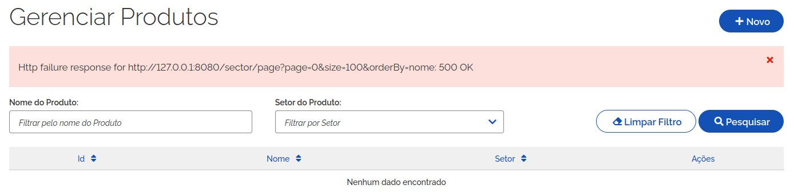

# Projeto Base

O presente projeto é referência, ou base, para o desenvolvimento de novos sistemas no Ibama. Ele é divido em backend, desenvolvido em Java, e frontend, ambientado em Node.js e Angular Typescript.

Para exemplificar os diversos elementos e aspectos do desenvolvimento de software nessas plataformas, estãos dispostos dois CRUDs (Create, Read, Update e Delete): produto e setor. Sendo setor, o agrupador ou categoria do produto. Portanto, são funcionalidades para manutenção de cadastro de produtos e seus setores.

A relação entre as entidades é: todo produto pertence a um setor, mas nem todo setor possui produtos. Ou seja, uma relação 1xN entre produto e setor.

O projeto Base distribui tais funcionalidades ao longo de 3 camadas: banco de dados, backend e frontend. E, assim como o software em si, este documento é estruturado nessa organização.

## 1. Pré-requisitos

O projeto Base, como uma aplicação corporativa, utiliza banco de dados relacional para armazenamento dos registros de setores e produtos.

Esta documentação não tem como escopo a instalação da infraestrutura de software do projeto, qual seja: banco de dados H2, banco de dados Oracle, Java, Apache Maven, Node.js ou NPM.

A partir dessas ferramentas, o projeto pode ser construído e executado.

### 1.1 Banco de Dados

O banco de dados utilizado no projeto Base depende do perfil spring boot utilizado na execução do backend. Maiores detalhes a respeito de perfil de execução do backend serão apresentados nas seções seguintes deste documento.

Por ora, é suficiente informar que o projeto Base já contém configurações para uso do banco H2 (perfil local) e banco de dados Oracle (demais perfis). Não há restrição de versão para o banco de dados Oracle.

### 1.2 Backend

O módulo backend do projeto Base está apoiado no framework Spring Boot, na versão 3.3.7, mais especificamente. No entanto, para a construção do módulo é usado o Apache Maven como plataforma de gestão de dependências do Spring Boot e também é quem coordena a execução de testes unitários, assim como a própria construção do artefato final. Tudo isso, apoiado em Java, versão 21 ou superior.

### 1.3 Frontend

Já o módulo frontend se utiliza de Node.js e Angular para implementar as funcionalidades acima citadas, ou seja, os CRUDs de produtos e setores.

A versão 20.18 do Node.js é sugerida para ser instalada. Quano ao NPM, a versão de referência é 10.8. A partir dessa infraestrutura, o módulo está pronto para sua construção.

## 2. Instalação

A construção dos módulos backend e frontend do projeto base podem ser efetivadas de forma paralela e completamente independente. Obviamente, o contrário ocorre na execução, na qual o backend depende da existência e em perfeitas condições de funcionamento do banco de dados. Assim como o frontend é totalmente dependente, quanto a seu funcionamento, do módulo backend em funcionamento.

### 2.1 Backend

Com JDK 21 e Apache Maven disponíveis, ou com a utilização de plugin compatível da IDE de preferência, o seguinte comando deve ser executado para a construção do backend, dentro da pasta de mesmo nome:

`mvn clean package -DskipTests`

Após a conclusão da construção, o arquivo base.jar está disponível na subpasta target. A cláusula `-DskipTests` evita a execução de testes unitários que podem ser avaliados com a supressão da mesma.

### 2.2 Frontend

Da mesma forma que no backend, o frontend pode ser construído através de execução da construção na linha de comando ou com uso de plugin de IDE de desenvolvimento. Atendo-se à linha de comandao, para construir esse módulo, deve-se executar:

`npm install`

Ao long da construção há a descarga de todas as bibliotecas das quais o frontend necessita. Inclusive o framework Angular Typescript da versão 15, ambiente no qual a identidade visual gov.br está apoiada. Não só a identidade, mas componentes angular gov.br são importadas e incorporadas ao módulo.

A [Padrão Digital do Governo](https://www.gov.br/ds/home) pode ser consultado para maiores detalhes a respeito da referida identidade visual.

## 3. Implantação e Execução

A execução dos módulos backend e frontend do projeto Base pode ser efetuadas de forma autônoma (standalone) ou como parte de ferramentas de orquestração de conteineres como Azure, Openshift ou AWS.

Cada um dos módulos do projeto possui o diretório *devops* com arquivo Dockerfile referência para implantação em contexto de conteinerização.

A presente documentação se limita ao contexto de execução autônoma apenas.

### 3.1 Backend

No contexto de backend, a execução faz uso direto de um dos executáveis Java. Dentro da pasta backend, executar:

`java -jar target/base.jar`

O framework Spring Boot, base desse módulo, em sua construção importa servidor web e o embute no arquivo base.jar. Portanto, a execução do comando acima disponibiliza as funcionalidades REST do backend na porta 8080 do servidor que o inicia.

É possível alterar a porta de execução do backend através da configuração de propriedade do Spring Boot:

`server.port=8090`

### 3.2 Frontend

O frontend pode ser disparado de duas formas: como parte do servidor Node.js ou como pacote a ser implantado em servidor web como Apache. A esta última, dá-se o nome de versão minificada do módulo.

Ao executar `npm start`, esse módulo inicia o serviço e o disponibiliza na porta 80. Assim como no backend, a porta de execução pode ser alterada no arquivo package.json, especificamente no *script start*. Em ambiente Linux, tal execução exige permissionamento de super usuário para que o serviço possa ser hospedado na porta 80.

O Angular permite a minificação do módulo frontend, o que faz, essencialmente, o pacote ser composto de elementos fundamentais da tecnologia web (arquivos html, css e imagens). Para produzir o pacote com estas características, executar:

`npm build --prod`

O parâmetro `--prod` indica o arquivo contendo dois endereços http, ou https: um do próprio frontend e outro do backend. O primeiro endereço como referência de roteamento entre as telas do frontend. O segundo como indicação do backend sobre o qual requisições REST são acionadadas para cumprimento das funções CRUD de setor e de produto.

## 4. Características

Algumas informações adicionais merecem destaque e são distribuídas nas seguintes seções.

### 4.1 Banco de dados

Conforme supracitado, o banco de dados H2, ou Oracle, pode ser utilizado como camada de armazenagem de dados. 

Independentemente da plataforma de banco de dados adotada, o módulo backend utiliza a biblioteca de gestão de banco de dados Liquibase. Com efeito, toda vez que esse módulo é disparado, uma avaliação automática ocorre sobre o banco de dados em busca de diferenças entre o que o módulo necessita para seu funcionamento e aquilo presente neste banco.

Na prática, e em específico do projeto Base, o par de tabelas produto e setor é investigado na base de dados. O esperado é uma estrutura de dados correspondente ao representado no diagrama de entidade-relacionamento abaixo:

A funcionalidade de rollback do Liquibase pode ser utilizada para desfazer parcial, ou integralmente o conjunto de scripts de criação das tabelas acima. A documentação de [rollback](https://docs.liquibase.com/commands/rollback/rollback.html) do Liquibase contém maior detalhamento.

### 4.2 Backend

O módulo backend do projeto Base está apoiado no framework Spring Boot, mais especificamente, na versão 3.3.7. Como tal, ele permite a utilização de vários perfis de execução, o que permite alternância entre conjuntos de configurações de acordo com o ambiente de trabalho, de maneira rápida e prática. A presente conjuntura de perfis do módulo conta com os seguintes contextos:

- Local - application-local.yml : frequentemente utilizado no cenário em que o banco de dados Oracle não estão disponível. Tal perfil utiliza banco de dados H2 que corresponde a uma base em memória, persistida em disco dentro da pasta backend/data;
- Development - application-dev.yml: perfil utilizado na maior parte do tempo para desenvolvimento e testes das funcionalidades do módulo;
- Homologação - application-hom.yml: perfil do ambiente de homologação, onde as funcionalidades estão mais estáveis e o usuário Ibama pode experimentar a aplicação;
- Production - application-prod.yml: contém as configurações adotadas em ambiente de produção;

Perfis adicionais podem ser incorporados ao conjunto acima e, naturalmente, suas propriedades do conjunto atual modificadas.

A ausenção de especificação de perfil de execução implica adoção do perfil padrão definido no arquivo application.yml:

    spring:
        profiles:
            active: local

Acima, o perfil local definido como padrão de execução. Variáveis de ambiente pode ser usadas para sobrepor tal valor. Na linha de comando, a variável SPRING_PROFILES_ACTIVE permite modificar esse valor sem que seja necessário reconstruir o artefato.

Dentre as configurações de banco de dados, pode-se destacar o schema padrão utilizado pelo backend:

    spring:
        jpa:
            properties:
                hibernate:
                    '[default_schema]': base

Isso decorre da política da administração dos banco de dados do Ibama que impõe a distinção entre schema de conexão com o banco de dados e do schema proprietário dos dados.

Por fim, uma seção importante de configuração do backend diz respeito ao SCA2 (Sistema de Controle de Acesso). Esse software não é parte do projeto Base, mas é quem realiza as funções de autenticação de usuário e autorização de uso de recursos conforme perfil de usuário. O detalhamento do funcionamento e, principalmente a configuração de uma aplicação junto ao SCA 2, foge ao escopo desta documentação. No entanto, de forma resumida os seguintes elementos devem ser criados e associdados entre si no SCA 2:

- Aplicação: identifica o repositório de elementos necessários às funções de autenticação e autorização;
- Módulo, funcionalidade e ação: ao menos, cada um desses elementos deve ser criado dentro de uma aplicação SCA 2;
- Perfil de usuário: ao menos um perfil circunscrido à aplicação deve ser criado;
- Vínculo entre usuário e perfil: associa um usuário, tipicamente um CPF pré-configurado no sistema SIGER, a um perfil da aplicação;
- Montagem de perfis de usuário: para o projeto Base foram criados no SCA 2 dois perfis (ROLE_BASE_VIS_FUNC_VIS_ACESSAR e ROLE_BASE_ADM_FUNC_CAD_CADASTRAR); o primeiro permite a visualização de dados enquanto que o segundo permite criar, editar ou remover elementos dos CRUDs de setor e de produto;

No contexto em que o usuário somente possui perfil de adminstrador, a listagem de registro está proibida, visto que falta o perfil de visualização. A tela abaixo mostra a falha que decorre da tentativa do fronted consultar backend em busca da listagem de produtos:

As propriedades do backend, abaixo, contém diferentes partes do processo de comunicação com o SCA, correspondentes ao login, validação de token e logout.

    security:
        sca2-login-get-jwt: https://homsca2.ibama.serpro.gov.br/sca2sessao/api/v2/sessao/login?service=%s&ticket=%s
        sca2-login-redirect: https://homlogin.sso2.ibama.serpro.gov.br/cas/login?service=%s
        sca2-system-url: http://127.0.0.1/base/login
        sca-get-token: https://homlogin.sso2.ibama.serpro.gov.br/sca2sessao/api/v2/sessao/login
        sca-token-validator: https://homsca2.ibama.serpro.gov.br/sca2sessao/api/v2/sessao/validar
        sca-logout: https://homsca2.ibama.serpro.gov.br/sca2sessao/api/v1/sessao/logout
        sca-logout-redirect: https://homlogin.sso2.ibama.serpro.gov.br/cas/logout?service=

Grande parte desses endereços se referem ao servidor de homologação do SCA 2, referência tanto para ambiente de desenvolvimento como de homologação do Openshift. No entanto, uma especial atenção é necessária sobre a propriedade `sca2-system-url` pois especifica o endereço que o navegador web é roteado nas seguintes situações:

- Após o login bem sucedido, no SCA 2, este é o endereço para o qual o navegador é direcionado;
- Ao acessar qualquer das telas do frontend de acesso restrito, e o usuário não estiver autenticado, o roteamento do navegador web ocorre para o endereço dessa propriedade. É esse parãmetro que identifica a aplicação requisitante de login no SCA 2, e para o qual o navegador é direcionado em caso de login bem sucedido;

### Frontend

Conjunto de configurações do frontend é diminuto quando comparado ao backend. O diretório `frontend/src/environments` contém arquivos de contexto, de ambiente de execução. No momento, há somente configurações para máquina local e produção, compostas das seguintes propriedades:

        apiUrl: 'http://127.0.0.1:8080/',
        home: 'http://127.0.0.1:80/',

A primeira propriedade indica o endereço do backend utilizado para consultas REST dos CRUDs. Enquanto que o segundo endereço é a referência base de roteamento do angular; muito importante em contextos de orquestração de conteiners ou servidor web. A partir daí, o roteamento de requisições http está por conta do angular e problemas de CORS enderaçados.

Dentre os elementos de interface do usuário, o menu de característica retrátil, mostrado abaixo, tem em seu comportamento padrão a retração automática quando do clique em algum de seus itens:

O componente *trilha de migalha de pão*, demonstrado abaixo, indica o trajeto de telas até o conteúdo correntemente visualizado pelo usuário. Cabe esclarecer seu funcionamento: qualquer das telas antecessoras podem ser visitadas a partir do clique no correspondente elemento da trilha, exceto a própria tela corrente cuja ação está desligada porque não há necessidade de efetuar roteamento à tela que já está em exibição.

No contexto CRUD, a tela de listagem de registros é que possui maior complexidade, justamente pela quantidade de ações que o usuário pode disparar.

No exemplo acima, contextualizado no CRUD de produto, pode-se executar:

- Requisição de novo produto: botão Novo;
- Filtrar registros com a especificação de valores nas caixas de texto e subsequente clique no botão *Pesquisar*;
- Limpar o conteúdo das caixas de texto ao clicar no botão *Limpar Filtros*;
- Visualizar produto da linha à qual pertence o ícone 'olho' clicado;
- Ir à tela de edição do registro correspondente à linha do ícone 'lápis';
- Remoção do registro da linha do ícone 'lixeira';
- A listagem, por definição, limita a visualização de 10 registros. Mas, o número de registros pode ser alterado, assim como a própria página corrente alterada de duas formas distintas: combobox e botões dos ícones '<' e '>';

A tela de visualização, inserção e edição; conforme mostrado abaixo, é mais simples, apesar de conjugar funções distintas.

Essencialmente, contém um formulário que oportuniza visualização, inserção e alteração de campos componentes da entidade de banco de dados gerenciada pelo CRUD. Excetuando-se o modo visualizar, a tela permite cancelar a ação corrente da tela ou salvar os dados. No modo visualizar, apenas há o botão voltar à tela de listagem do CRUD.

No contexto de restrição de acesso através de perfis de usuário oriundos do SCA 2, é possível, por exemplo, habilitar ou não os botões da interface ao consultar a lista de perfis do usuário. A tela abaixo se encaixa no contexto onde o usuário tem perfil de visualização de dados mas não pode alterar produtos. Notar que apenas o botão de visualização está disponível ao usuário, ao passo que os botões novo, editar e remover estão desabilitados.

## 5. Considerações Finais

A questão final, em relação ao projeto Base, diz respeito à qualidade do código. Nesse contexto, o projeto se coloca como modelo a ser seguido, não só na qualidade dos indicadores como também nas soluções adotadas no âmbito de teste unitário.

No backend, os testes unitários cobrem situações comumente fora do escopo de atuação de projetos regulares como averiguar permissionamento de perfil de usuário, de acesso a endpoints REST ou montagem de predicados de consulta SQL a banco de dados. A partir disso, chegou-se aos seguintes indicadores de qualidade de código para o módulo backend:

O mesmo se aplica ao módulo frontend, para o qual há testes contemplando permissionamento de perfis de usuário, testes sobre componentes compostos via herança e testes sobre elementos do leiaute da interface como menu, trilha de migalha de pão e tabela de listagem de registros. Com efeito, o conjunto de indicadores abaixo corresponde ao código do frontend:

Software sempre tem espaço para melhorias, em qualquer de suas camadas. No entanto, o projeto Base tem por objevtivo cobrir os principais aspectos e requisitos funcionais e não funcionais recorrentes nos projetos do Ibama.